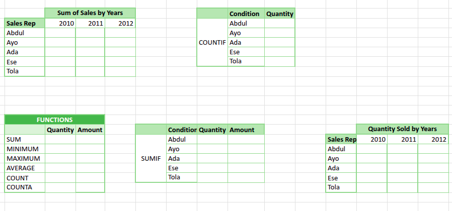

# Kabir Retail Solutions

## Regional Sales Performance Audit & GitHub Submission Guide

---

## Business Sceneria

You have been hired as a Junior Data Analyst at Kabir Retail Solutions.

The Sales Manager has provided a raw dataset containing transactions from five Sales Representatives over a three-year period.

As the company prepares for the 2013 fiscal year, management needs clear answers to:

- Who is the most consistent performer?
- Who generates the highest sales volume?
- Where is performance improving or declining?

Your role is to analyse the data and present your findings in a structured, professional format.

---

## Objective
Transform the raw dataset into a clear business report using:

- Excel (for analysis)
- GitHub (for communication and submission)

This assignment tests both your **technical skills** and your **ability to present insights clearly**.


## Getting the Data (MANDATORY — CLI)

You must download the dataset using Git (Command Line).

### Step 1: Clone the Data Repository

Run the following command in your terminal:

```bash
git clone https://github.com/<your-username-or-org>/kabir-retail-data.git
```
### Step 2: Navigate into the Folder

`cd kabir-retail-data`

### Step 3: Locate the Dataset

Open the `data/` folder — your Excel file is inside.

⚠️ Do NOT manually download the file from GitHub UI. You must use git clone.


## Your Task

#### Part 1: Recreate Tables
Recreate all summary tables provided in the dataset.

---

### Part 2: Data Analysis (Using Only Taught Functions)

You must use only the following Excel functions:

`SUM, COUNTIF, SUMIF, MIN, MAX, AVERAGE, COUNT, COUNTA`

Answer the following:

#### 1. Inventory Impact
- Total quantity sold across all years  
- Total quantity sold per year
- Average quantity sold per year

#### 2. Performance Extremes
- Highest transaction amount  
- Lowest transaction amount  

#### 3. Representative Activity
- Use `COUNTIF` to calculate number of transactions per Sales Rep  
- Identify the most active representative  

#### 4. Financial Contribution
- Use `SUMIF` to calculate total revenue per Sales Rep  

#### 5. Yearly Trends
- Create a table showing total **Quantity Sold** for:
  - 2010  
  - 2011  
  - 2012  

---
### Part 3: Conditional Formatting (Business Alert)

Apply Conditional Formatting to the **Revenue** column:

- Values **> 15,000 → Green (High Value)**
- Values **< 6,000 → Red (Low Value)**

---

## Submission Instructions (GitHub — STRICT)

Follow these steps exactly.

---

### Step 1: Create Repository

Create a new GitHub repository named:

`kabir-sales-analysis`

---

### Step 2: Add Files

Your repository **must contain**:

- `README.md`
- `/images` (folder)
- Excel file (optional but recommended)

NOTE on how to create your `README.md` - You can create/edit files using:
- Notepad (Windows users)
- TextEdit (Mac users)
- Any basic text editor

OR (recommended but optional): Use Visual Studio Code if you have it on your laptop or you can simply install it if you like. 

What is important is that your final file must be named: README.md to ensure it renders properly on Github

---

### Step 3: Write Your README

Your `README.md` is your **final report**. It must include:

---

### 1. Executive Summary (2–3 sentences)

Clearly state:

- Are sales increasing, decreasing, or stable?
- Overall business health

---

### 2. Visual Evidence (MANDATORY)

You must include screenshots of your work.

#### Important Requirement
Your screenshots must show formulas:

- Either click on a cell (formula visible in formula bar), OR  
- Press `Ctrl + ~` to display all formulas  

---


#### Required Screenshots

Include:

- Representative Performance Table  
- Yearly Summary Table  
- Any additional analysis tables  

---

#### How to Add Images

1. Save screenshots in `/images` folder  
2. Reference them in README like this:

```markdown
 -  Example below
```



### 3. Business Recommendations

Answer clearly:

Efficiency
- Which Sales Rep has the highest transaction count but not the highest revenue?
- What does this suggest about their sales behaviour?
Trend Analysis
- Based on yearly performance:
- Should the company hire more staff in 2013 or reduce?
- Explain your reasoning

### Step 4: Commit and Push Your Work

```bash
git add .
git commit -m "Final submission"
git branch -M main
git remote add origin https://github.com/<your-username>/kabir-sales-analysis.git
git push -u origin main
```

## Important Rules
* You must use CLI (no manual download from browser)
* Do not use formulas outside those taught in class
* Do not submit incomplete screenshots
* Do not submit without a properly written README
* Your GitHub repository is your submission

* Submit your repository through the link [here]


